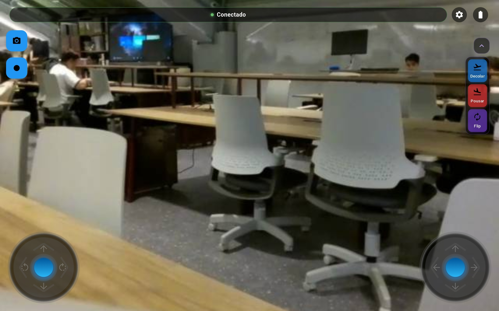

# Interface do Usuário

## Layout Geral

A interface do aplicativo Athenas foi projetada com foco na usabilidade durante operações de voo, seguindo princípios de design minimalista e funcional. O layout é organizado em regiões estratégicas para facilitar o acesso rápido aos comandos mais importantes durante o voo.

### Organização da Tela Principal

A tela principal do aplicativo é dividida em várias regiões funcionais:

1. **Stream de Vídeo**: Região central e predominante, exibindo o feed da câmera do drone em tempo real
2. **Painel de Controle**: Localizado na lateral direita, contém botões para comandos principais
3. **Joystick Direcional**: Posicionado no canto inferior esquerdo para controle de movimento horizontal
4. **Joystick de Altitude**: Posicionado no canto inferior direito para controle de altitude e rotação
5. **Barra de Status**: Na parte superior, exibindo informações críticas como nível de bateria e qualidade do sinal
6. **Controles da Câmera**: Na parte inferior da tela, para captura de fotos e vídeos

## Componentes da Interface

### VideoStreamWidget

Este componente central exibe o feed da câmera do drone em tempo real, utilizando técnicas de baixa latência para garantir resposta visual imediata.

```dart
VideoStreamWidget(
  streamUrl: '${state.serverConfig.serverUrl}/video_feed',
  isConnected: isConnected,
)
```

Características:
- Modo de tela cheia com gestos para zoom
- Sobreposição de telemetria (altitude, velocidade, distância)
- Indicadores visuais para orientação do drone

### DroneControlPanel

Painel que contém os principais controles de voo:



Funções principais:
- **Decolagem Automática**: Inicia o procedimento de decolagem controlada
- **Pouso Automático**: Inicia o procedimento de pouso seguro
- **Retorno ao Ponto Inicial (RTH)**: Comando para o drone retornar automaticamente ao ponto de decolagem
- **Parada de Emergência**: Botão de destaque para situações críticas
- **Status da Conexão**: Indicador visual do estado da conexão com o servidor

### StatusNotification

Componente que exibe notificações e alertas importantes durante o voo:

```dart
StatusNotification(
  message: state.lastMessage,
  type: state.lastMessageType,
  visible: state.showNotification,
)
```

Tipos de notificação:
- **Info**: Informações gerais sobre o status do sistema
- **Success**: Confirmações de comandos bem-sucedidos
- **Warning**: Alertas de baixa prioridade (bateria abaixo de 30%, proximidade de limite de alcance)
- **Error**: Alertas críticos (bateria crítica, perda de sinal, falha de componente)

### SplashScreen

Tela de inicialização que é exibida durante o carregamento do aplicativo:

```dart
SplashScreen(
  logo: 'assets/logo_athenas.png',
  title: 'Athenas Drone Control',
  subtitle: 'Conectando ao servidor...',
)
```

### Telemetria e Indicadores

A interface inclui diversos indicadores que fornecem informações em tempo real:

- **Indicador de Bateria**: Exibe o nível atual de carga da bateria do drone com código de cores
- **Indicador de Sinal**: Mostra a intensidade da conexão Wi-Fi com o drone
- **Altímetro**: Exibe a altitude atual do drone em relação ao ponto de decolagem
- **Velocímetro**: Mostra a velocidade horizontal do drone
- **Bússola**: Indica a orientação do drone em relação ao norte magnético
- **Distância**: Mostra a distância horizontal entre o drone e o ponto de decolagem

## Responsividade

O aplicativo foi projetado para se adaptar a diferentes tamanhos de tela, desde smartphones (em modo paisagem) até tablets. Os elementos da interface redimensionam-se automaticamente para manter a proporcionalidade e funcionalidade em diferentes dispositivos.

### Breakpoints de Responsividade

- **Telas pequenas** (< 7 "): Interface compacta com controles redimensionados
- **Telas médias** (7-10"): Layout equilibrado com tamanho otimizado de controles
- **Telas grandes** (>10"): Layout expandido com informações adicionais de telemetria

### Feedback Tátil (Haptic)

- Vibração suave para confirmação de comandos
- Vibração intensa para alertas críticos

## Acessibilidade

O aplicativo incorpora recursos de acessibilidade:

- **Alto Contraste**: Opção para melhorar a visibilidade em condições de luz solar direta
- **Feedback Sonoro Aumentado**: Opção para intensificar alertas sonoros
- **Controles Redimensionáveis**: Possibilidade de aumentar o tamanho dos controles virtuais

## Temas e Personalização

Embora o tema escuro seja o padrão, o aplicativo permite personalização limitada:

- **Cores de Destaque**: Possibilidade de alterar a cor de destaque da interface
- **Opacidade dos Controles**: Ajuste da transparência dos elementos flutuantes
- **Densidade de Informações**: Ajuste da quantidade de dados exibidos simultaneamente
